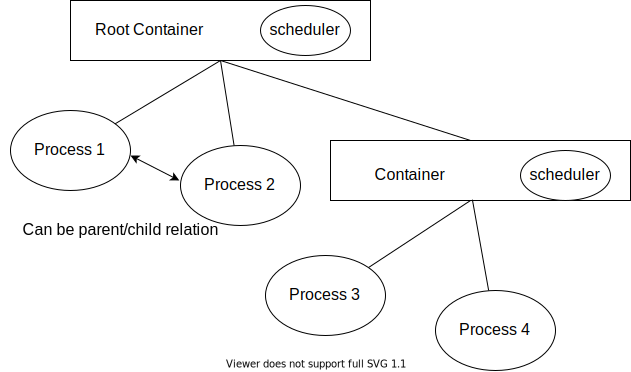

# Lab6 More MULTIs

MULTI-process, MULTI-scheduler, container

------

First, add lab6 code:
```sh
git fetch --all
git checkout lab6
git merge lab5 # Or lab5-dev, or else
# Handle Marge Conflicts
```

## 6.1 MULTI-process

Not all processes finishes in `exit`. Some may deliberately execute an infinite loop.

The timer interrupt helps to preempt running processes. However, in current design, it just traps and then goes back to its user mode.

As we implement round-robin-like schedule policy, in timer interrupt, we should `swtch` to the scheduler and make another scheduler desicion.

> You can set the time slice to be one or more time ticks(interrupts).

`yield()` in `core/proc.c`, to be implemented by us, is similar to `exit()` when it comes to giving to exection control to the scheduler. But this function **will** return, which is the ordinary path in lab3. You would meet trouble if bugs exist in `swtch()` or `struct context`.

In addition to implementing `yield()`, you should also call it in appropriate place.

## 6.2 MULTI-scheduler, container

The feature of `struct sched_op` and `struct scheduler` makes it easy for us to implement multi-scheduler design.

Here is the structure of the new design:



Containers have the following features:

* Containers are composed of a resource manager and a kernel-mode process (scheduler).
* The interfaces of the resource manager are used through a call-return form while the scheduler is activated by context switches.
* The memory of containers are dynamically allocated, using the memory pool.
* Each container manages its whole subtree but only allocates the memory of its children.
* Each container maintains its process id. It records the mapping when a new process spawns in its subtree.
* Processes have "different" IDs in the view of different containers.

Schedulers have the following features:

* Schedulers have per-cpu contexts.
* Each scheduler has a process table.
* Currently, the memory of process control blocks are allocated when the scheduler is allocated. This does not scale, so you can dynamically allocate the memory of PCBs.
* In this round-robin-policy, after switching from a process (or scheduler), it yields control to its parent scheduler until reaching the root.

The scheduling structure has the following features:

* Leaf nodes are processes that have user-mode code.
* Non-leaf nodes are schedulers that works only in kernel mode.
* Ellipses are shown as processes and have own contexts. Control Changes between them should all use `swtch()`.
* This structure does not show the parent/child relation of processes.

The following functions should be implemented:

* `scheduler_simple(this)`, `sched_simple(this)`, and `alloc_pcb_simple(this)` in `core/sched.c`. These functions works almost the same as those in `sched_simple.c`, other than the `ptable` belongs to `this` instead of being shared globally.
* `yield_scheduler(this)`in `core/sched.c`. Like `yield()`, it switches to its parent process. Pay attention to the locks to be acquired and released. 
* `container_entry()` in `core/container.c`. It is the entry of newly-spawned schedulers. Like `forkret`, it should release a lock. Then, it should set `thiscpu()->scheduler` and call `enter_scheduler()`.
* `alloc_container(bool root)` in `core/container.c`. It is very similar to `alloc_proc()` in `core/proc.c`. A kernel stack containing the context should be reserved for each CPU. Trap-frames can be skipped. The runtime and kernel stack of the root container is pre-allocated, so only the container structure is needed.
* `init_container()` in `core/container.c`. It initials the memory pool and the root container.
* `alloc_resource(this, p, resource)` in `core/container.c`. Resource allocation should be recorded in each container that manages this process. Currently, you can implement PID resource only, which records the mapping between the process pointer and local PID. The return value is `void *` which can be shown as an integer or a pointer for different types of resources.
* `spawn_container(this, op)` in `core/container.c`. It adds a child node at `this` container. `op` is the scheduler operators of the new scheduler.
* `add_loop_test(times)` in `core/proc.c`. It works almost the same as `spawn_init_process` but adds code within [loop_start, loop_end). This two symbols are declared in `user/loop.S`.

Note:

* We do not need to modify `core/proc.c` a lot because of the function entries in `core/sched.h`. However, you should manage `thiscpu()->proc` and `thiscpu()->scheduler` in `core/sched.c`.
* Schedulers uses `scheduler->context[cpuid()]` instead of `p->context`. You can use `((struct container *)p->cont)->scheduler->context[cpuid()]`.

Why container?

* Supporting process groups enables multi-scale process management.
* Multi-scheduling exploits more parallism even using coarse-grained lock.
* ...

More things to do:

* Container migration. Move a non-ordinary subtree to another node.
* User-defined scheduling. Add a system call or design a user-level program to create a container with user-defined scheduler.
* Record CPU usage of process groups, which can be counted in timer ticks.
* ...

Real world container:

* cgroup
* namespace

## 6.3 Test for the above sections

In this test, one loop process is added at the root countainer and 8 loop processes at a new container. These processes should not be treated equally. The one at the root container should have more chances to be executed than the other 8, so it should finish earlier. The other 8 should follow soon (count to 31).

If `yield()` is not supported, some of the 8 processes may not finish counting.

The processes of the new container should have different PIDs in this container and root container.

The output would be like:

```
CPU 0: HELLO!
CPU 3: HELLO!
CPU 2: HELLO!
CPU 1: HELLO!
pid 7, pid in root 10, cnt 31
pid 8, pid in root 11, cnt 30
pid 8, pid in root 11, cnt 31
CPU 0: HELLO!
CPU 3: HELLO!
CPU 2: HELLO!
CPU 1: HELLO!
```

Printing `CPU x: HELLO!` means the scheduled process have finished counting and enter the infinite loop. Sometimes, completed processes may be scheduled even others have not finished. Discuss about why.

## 6.4 Sleep and Wake

This two functions in `core/proc.c` is implemented for use later.

`sleep` acts like `yield()` but changes the process state to sleep mode. The channel parameter is a pointer key. When `wake` is called, all processes slept with this key would be waken.

## Submission

Deadline: two or three weeks

Submit a PDF as usual.

